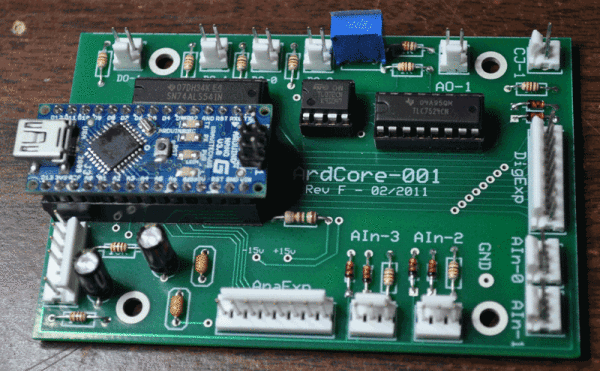
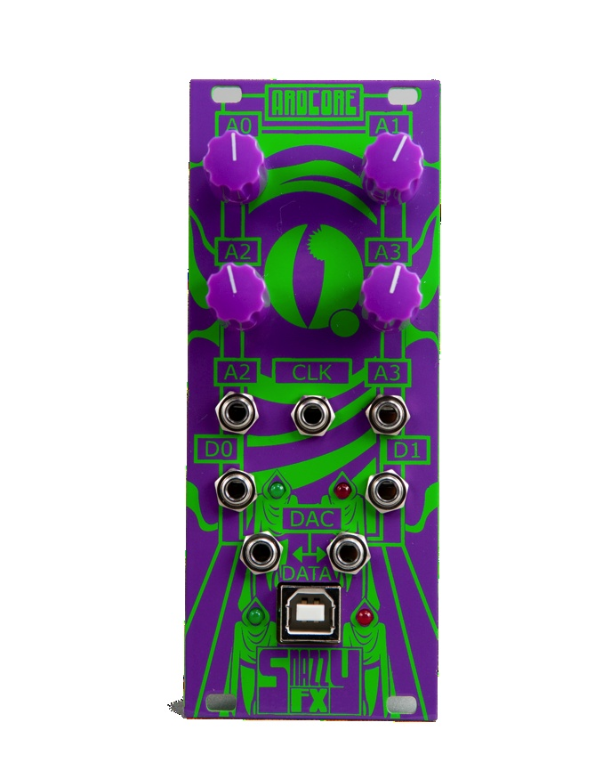
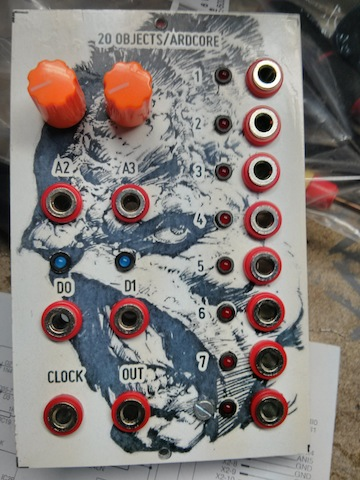
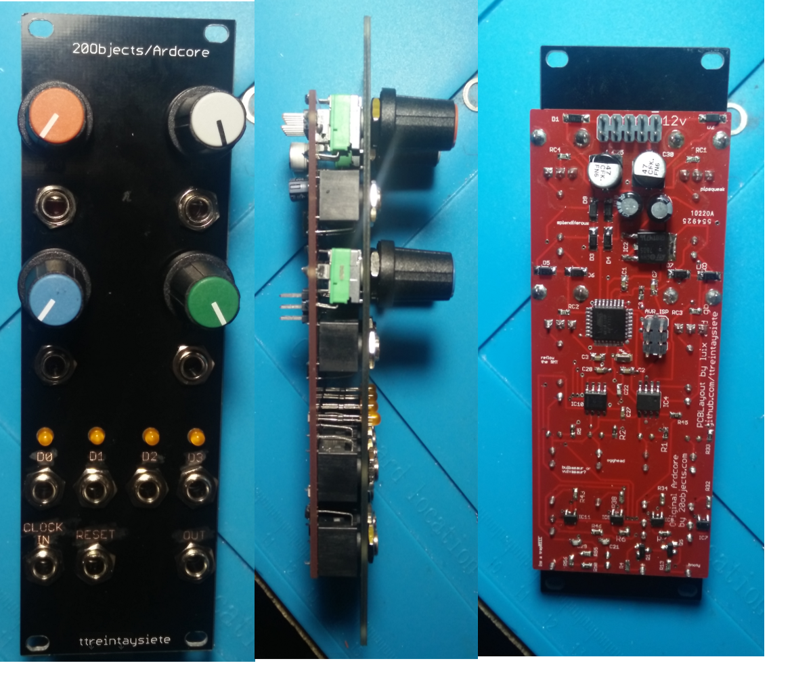

# Eurorack Ardcore 2017
This is the repository for the tuned sketches, schematics and board files of the new 2017 version 20Objects Ardcore. The Ardcore is an Arduino based module created by Darwin Grosse as his final work for MS. You can find more information on the orignal project in his website http://20objects.com/ardcore/.

So far there are a couple of versions of the ardcore, the original one by 20Objects which was a PCB only, AFAIK it was intended for dotcom and 5U formats and all the wiring with the panel has to be done manually. This version has 4 AnalogInputs, 2 of them are potentiometers and the other 2 are inputs. It also has 2 digital outputs (i.e. for triggers).



The [original sketches](https://github.com/darwingrosse/ArdCore-Code/commits/master) were first published by Darwin back in 2012. This project originally was a DIY PCB only project.

Later on SnazzyFX published an eurorack format of the module and (as Dan a.k.a. told me) it was long out of stock due its success for a couple of years. 



There are plenty of threads in muffwiggler talking about different DIY versions, back in 2013 we made our own version for bananas.



The Ardcore is not so well known module but its a power house due its flexibility, it has several sketches that are very usefull and fun to play, but more important the Ardcore is a module that tries to embed the Arduino philosophy into the modular synthesizer community which is to allow musicians, artists and engineers to easly create microcontroller based modules.

Due its digital nature, the ardcore is very good for creating CV sources that are otherwise more complex to create with hardware (like a drunken walk), but it also can create audio with the DAC.

# Our implementation of Ardcore



So we decided to make a skiff friendly, DIY Ardcore with several improvements:

* double the number of __analog inputs__. So now each AnalogInput has a potentiometer that is normalized to 5v when nothing is connected, when you plug something into the corresponding jack you can still use the potentiometer to attenuate the incommin signal. All analog inputs are protected with diodes (1n4148) so voltage will be cliped to the microcontroller range always (0v-5v). In any case you can use the pot as mentioned to attenuate the incomming signal.

* double the number of __digital outputs__. The original ardcore had 2 digital outputs, in this version we put D2 and D3 for a total of 4. This outputs are driven by the Tristate buffer widely used in digital modules like Mutable Instruments, so you can both isolate microcontroller pin from the outside world at the same time to upscale the voltage and buffer it. So if you plug an output signal into the digital outputs you can't damage the micro controller.

* double the number of __digital inputs__, the original and snazzy Ardcore had 1 multipurpouse digital input labeled as "clock". This input is connected to a pin in the micro controler with support for interrupts which are very usefull when you want to have "responsive" or non blocking behaviours on your sketch. In the new ardcore we added a second digital input labeled __RESET__ which is also connected to another interrupt pin. All the existing sketches were created for the previous hardware versions of the ardcore so they __don't__ use this pin.

* Upgraded DAC, from parallel to SPI and from 8bit to 12bit. This upgrade was both a must go mainly because of the size of the IC and that its easy to source it, also the PCB has less trace (since parallel communication uses 8 connections from atmega328 to the DAC, in comparison with the SPI that only uses 3 wires.

* 8hp Skiff friendly.

# The bad things

Some of the decissions taken during the pcb design have downsides.

* When upgrading the DAC from parallel to SPI we lose all the "bit" traces from the parallel connections, so its not possible to easly create an expander for this version of the module.

* Another problem from upgrading the DAC is that the original sketches that used it, need a small tweak on the code in order to work properlly. This is based on the Euroardcore but with the mcp4921

  * you need to add to the beggining of any sketch using the DAC,
    ```
    #include <SPI.h>
    #include <DAC_MCP49xx.h>
    DAC_MCP49xx dac(DAC_MCP49xx::MCP4921, 10);
    ```
  * also you need to add the following code at the end of the __setup()__ so the DAC is properlly initialized:
    ```
    dac.setBuffer(true);        //  Set FALSE for 5V vref.
    dac.setGain(2);             //  "1" for 5V vref. "2" for 2.5V vref.
    dac.setPortWrite(true); 
    ```
  * and finally replace the __dacOutput()__ and __dacOutputfast()__ to be something like:
    ```
     void dacOutput(long v)
    {
      dac.outputA(v);
    }
    ```

* No USB, need a programer.. original ardcores had either an arduino nano or a ftdi IC with USB on the board, so you can directly upload your sketches. With this version you need an external programmer that uses ISP, we recommend the official [AVRISP mkii](http://www.atmel.com/tools/avrispmkii.aspx).
